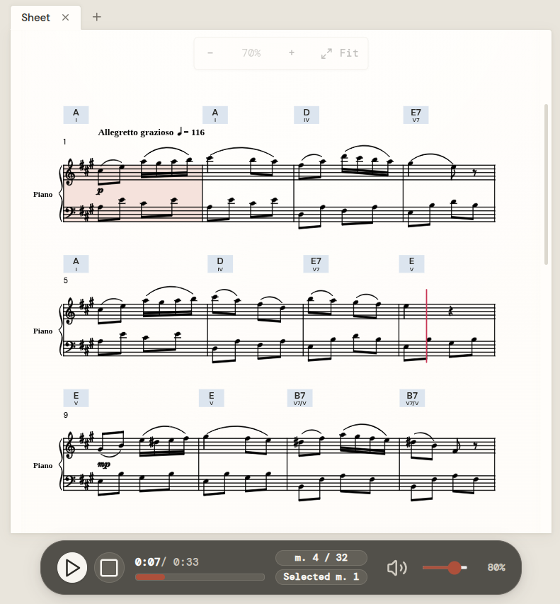

<div align="center">

# 🎼 Chorale

**A high-precision music notation workspace and MCP tool server for AI coding agents.**

[](package.json)
[](LICENSE)
[](package.json)
[](package.json)

[Overview](#-overview) •
[Quick Start](#-quick-start) •
[Contributing](#-contributing) •
[Agent Setup](#-ai-agent-setup-codex-claude-antigravity) •
[Features](#-features) •
[Tech Stack](#-tech-stack) •
[License](#-license)

</div>

---

## 🌟 Overview

**Chorale** is an AI agent companion for reading, analyzing, and composing music. Give your agent a score and it can explain what is happening, annotate chord progressions with chord symbols and Roman numerals, trace phrases and cadences, examine form and voice leading, or help turn a musical idea into a complete piece.

Work with your agent directly on the music: create a new score, import an existing one, focus on a passage, and ask for targeted revisions. Chorale pairs interactive sheet music with hands-on ABC source editing, so you can review every suggestion, refine the notation yourself, transpose or play back the result, and keep composing together.

<div align="center">


</div>

## 🚀 Quick Start

### Let your agent set it up

Ask your coding agent to install Chorale's MCP/plugin integration. It can follow the complete, agent-specific instructions in [INSTALL.md](./INSTALL.md) and then use Chorale tools to create, inspect, and edit scores.

Copy and paste this into your agent:

```text
Set up Chorale for me using its MCP server or plugin. Follow the installation instructions at https://github.com/hxy9243/chorale/blob/main/INSTALL.md, then confirm that Chorale is connected and ready to use.
```

### Example: Compose a Piano Piece

Once Chorale is connected, ask your agent to create and open a score:

```text
Use Chorale to compose an original 16-measure piano piece inspired by Mozart's Classical-era style. Write it in C major, 4/4, at a moderate tempo, with a singable right-hand melody and an Alberti-bass accompaniment in the left hand. Use clear phrase structure, then open the finished score in Chorale so I can review and play it.
```

### Manual setup

Install Chorale directly from GitHub (Node.js 22.5+ required):

```bash
npm install --global github:hxy9243/chorale
```

Start Chorale from the command line:

```bash
# Start the background service on port 1685 and open the workspace
chorale
```

To start it from an agent, register its MCP command. The MCP adapter starts the same background service automatically:

```bash
codex mcp add chorale -- chorale mcp
```

For Codex plugin setup, Claude, Antigravity, and other MCP-client examples, see [INSTALL.md](./INSTALL.md).

---

## 🤝 Contributing

Pull the source and run the development workspace locally:

```bash
git clone https://github.com/hxy9243/chorale.git
cd chorale
npm install
npm run dev
```

`npm run dev` starts the Vite development server at `http://localhost:5173/`. Before opening a pull request, run:

```bash
npm test
npx tsc -b
npm run lint
```

---

## 🤖 AI Agent Setup (Codex, Claude, Antigravity)

Chorale is equipped with skills and MCP definitions ready for pair programming with autonomous agents:

- **Google Antigravity**: Packaged via `npm run package:antigravity` (auto-copies skills into `plugins/antigravity/skills/`) and installed via `agy plugin install plugins/antigravity`, or detected directly in `.agents/skills/chorale-score/SKILL.md`.
- **OpenAI Codex**: Manifest in [`.codex-plugin/plugin.json`](./.codex-plugin/plugin.json) and installable via local marketplace or `codex mcp add`.

  Before a local marketplace installation, run `npm run package:codex` to generate the self-contained plugin in `plugins/chorale-codex-plugin` (auto-copying skills and bundled runtime). Rebuild and reinstall after source updates; start a new Codex task to load the updated tools.
- **Claude Code & Claude Desktop**: Configurable via stdio (`chorale mcp`) or SSE (`http://127.0.0.1:1685/sse`).

For complete, step-by-step agent installation guides and MCP configurations, see:  
👉 **[INSTALL.md](./INSTALL.md)**

---


## ✨ Features

- **CLI-First Architecture**: Run `chorale` as an independent CLI tool that manages the server in the background and opens the interactive workspace in your browser on demand.
- **Model Context Protocol (MCP)**: Full stdio and SSE MCP server on port 1685 exposing 16 modular musical score tools to Codex, Claude Code, and Antigravity.
- **Durable Local Storage (`~/.chorale/`)**: Scores and revisions persist directly in `~/.chorale/chorale.db` (SQLite via `node:sqlite`) and `~/.chorale/scores/`.
- **Bounded Measure Operations**: Fast, deterministic measure reading (`read_measure`), insertion (`insert_measure`), replacement (`edit_measures` / `edit_measure`), and deletion (`delete_measures`) with optimistic revision guards.
- **Harmonic Annotations**: Add, edit, delete, and list annotations with Roman numeral analysis and chord symbols directly on the score.
- **MusicXML & MXL Import**: Drag-and-drop or programmatic import of `.xml`, `.musicxml`, and compressed `.mxl` files converted via `@educandu/abc-tools`.
- **Interactive Sheet Music**: High-legibility SVG score rendered via `abcjs` with dynamic zoom (60% to 180%) and key transposition.
- **WebAudio Piano Synthesizer**: Audio player with tempo scaling (50% to 180%), volume control, and active note cursor highlighting (`#e11d48`) on the SVG score during audio playback.
- **Score Video Export**: Export sheet music video animations with WebCodecs AAC/MP4 rendering.
- **Desktop Electron Archive**: The original standalone Electron desktop shell is preserved intact on branch `electron` (tag `v0.1-electron-archive`).

---

## 🛠 Tech Stack

- **CLI & MCP Server**: Node.js + `@modelcontextprotocol/sdk` + `zod`
- **Notation & Audio**: `abcjs` + `@educandu/abc-tools` + `abc-utils`
- **Video Export**: `@mediabunny/aac-encoder` + `mediabunny`
- **Frontend Framework**: React 19 + Vite + TypeScript
- **Archive Extraction**: `jszip`
- **Design Tokens**: Custom CSS Paper/Glassmorphism + `lucide-react`
- **Testing**: Node Test Runner + Vitest + `@testing-library/react` + `jsdom`

---

## 📜 License

[MIT License](./LICENSE) © 2026 Chorale
