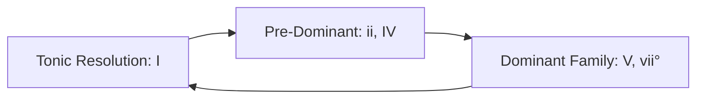

# Chord Progression Analysis & Harmonic Syntax Guide

This guide establishes the theoretical methodology, Roman numeral notation conventions, functional harmonic syntax, and diagnostic procedures for analyzing chord progressions in Chorale.

---

## 1. Step-by-Step Vertical Sonority Extraction

To analyze the harmony of polyphonic music represented in ABC:

### Step 1: Align Voices by Metric Beat Offsets
Multi-voice ABC scores distribute events across distinct lines (`[V:1]`, `[V:2]`, etc.). To determine vertical sonorities:
1. Locate note onsets across all active voices at the identical rational beat offset within the measure.
2. Note sustained notes (tied notes `-` or longer durations) sounding concurrently with newly articulated pitches.

### Step 2: Identify the Sounding Bass Note
- The **lowest pitch sounding in that vertical slice** (usually in Voice 4 or the lowest active stave) defines the bass.
- The bass note is critical because it dictates chord inversion regardless of pitch order in upper voices.

### Step 3: Filter Non-Chord Tones (NCTs)
Before naming the harmony, isolate and filter decorative melodic pitches:
- Suspensions, passing tones, neighbor tones, and appoggiaturas are melodic ornamentations, not chord factors (consult the [Voice Leading & General Analysis Guide](voice-leading-and-general-analysis.md)).

### Step 4: Collect Pitch Classes & Stack in Thirds
1. Take the remaining pitch classes (e.g. $\{C, E, G, B\flat\}$ or $\{D, F\sharp, A\}$).
2. Arrange them in ascending thirds: $\text{Root} - \text{3rd} - \text{5th} - \text{7th} - \text{9th}$.
3. The root of the stacked thirds identifies the fundamental harmony.
4. Compare the sounding bass note to the root to assign the correct inversion.

---

## 2. Roman Numeral Analysis & Inversion Symbols

### A. Case & Quality Conventions
- **Uppercase Roman Numerals** ($\text{I}, \text{IV}, \text{V}$): Major triads.
- **Lowercase Roman Numerals** ($\text{ii}, \text{iii}, \text{vi}$): Minor triads.
- **Lowercase with Degree Sign** ($\text{vii}^{\circ}, \text{ii}^{\circ}$): Diminished triads.
- **Uppercase with Plus Sign** ($\text{III}^{+}$): Augmented triads.
- **Half-Diminished Seventh** ($\text{vii}^{\varnothing 7}$): Minor-third, minor-third, major-third.
- **Fully Diminished Seventh** ($\text{vii}^{\circ 7}$): Three stacked minor thirds.

### B. Inversion & Figured Bass Reference Table

| Chord Type | Sounding Bass Factor | Figured Bass | Roman Numeral Example (in C Maj) | Description |
| --- | --- | --- | --- | --- |
| **Triad** | Root | $\text{5/3}$ (omitted) | $\text{I}, \text{IV}, \text{V}$ | Root position |
| **Triad** | Third | $\text{6}$ or $\text{6/3}$ | $\text{I}^6, \text{ii}^6, \text{V}^6$ | First inversion |
| **Triad** | Fifth | $\text{6/4}$ | $\text{I}^{6/4}, \text{IV}^{6/4}$ | Second inversion |
| **7th Chord**| Root | $\text{7}$ | $\text{V}^7, \text{ii}^7$ | Root position 7th |
| **7th Chord**| Third | $\text{6/5}$ | $\text{V}^{6/5}, \text{vii}^{\circ 6/5}$ | First inversion 7th |
| **7th Chord**| Fifth | $\text{4/3}$ | $\text{V}^{4/3}, \text{ii}^{4/3}$ | Second inversion 7th |
| **7th Chord**| Seventh | $\text{4/2}$ or $\text{2}$ | $\text{V}^{4/2}, \text{V}^2$ | Third inversion 7th |

### C. The Four Classical Types of Second-Inversion ($\text{6/4}$) Chords
Second-inversion triads ($\text{6/4}$) contain a dissonant fourth above the bass and must never be treated as freestanding stable harmonies:
1. **Cadential $\text{6/4}$ ($\text{Cad}^{6/4}$ or $\text{I}^{6/4}$)**:
   - Metrically strong; functions as a double suspension delaying the dominant:
   - Bass holds or doubles scale degree $\hat{5}$.
   - Upper voices form 6–5 and 4–3 resolutions over the bass: $\text{I}^{6/4} \rightarrow \text{V}^{(7)} \rightarrow \text{I}$.
2. **Passing $\text{6/4}$**:
   - Metrically weak; bridges a stepwise moving bass line between root position and first inversion:
   - e.g. $\text{I} \rightarrow \text{V}^{6/4} \rightarrow \text{I}^6$ (bass: $\hat{1} - \hat{2} - \hat{3}$) or $\text{IV} \rightarrow \text{I}^{6/4} \rightarrow \text{IV}^6$.
3. **Pedal (Neighbor) $\text{6/4}$**:
   - The bass remains stationary on a held pedal pitch while upper voices expand up by step and return:
   - e.g. $\text{I} \rightarrow \text{IV}^{6/4} \rightarrow \text{I}$ (bass holds $\hat{1}$; upper voices move 5–6–5 and 3–4–3).
4. **Arpeggiated $\text{6/4}$**:
   - Bass arpeggiates the notes of a single static harmony:
   - e.g. $\text{I} \rightarrow \text{I}^6 \rightarrow \text{I}^{6/4}$ (bass leaps between root, third, and fifth).

---

## 3. Functional Harmonic Syntax & Phrase Trajectories

Tonal harmony operates through goal-directed functional families:



### A. The Harmonic Functional Families
1. **Tonic (T)**: $\text{I}, \text{i}$ (and submediant $\text{vi}, \text{VI}$ as tonic substitute). Represents stability, resting point, tonal gravity.
2. **Pre-Dominant / Subdominant (PD)**: $\text{IV}, \text{iv}, \text{ii}, \text{ii}^6, \text{ii}^{\circ 6}$. Prepares the dominant by introducing scale degrees $\hat{4}$ and $\hat{6}$.
3. **Dominant (D)**: $\text{V}, \text{V}^7, \text{vii}^{\circ}, \text{vii}^{\circ 7}$. Contains the leading tone ($\hat{7}$) pulling with maximum tension to the tonic ($\hat{1}$).

### B. Functional Rules & Forbidden Retrogressions
- **Standard Syntax**: $\text{Tonic} \rightarrow \text{Pre-Dominant} \rightarrow \text{Dominant} \rightarrow \text{Tonic}$.
- **Retrogression Guard**: In common-practice Classical and Baroque music, dominant harmonies do NOT resolve backward to pre-dominants (e.g. avoid $\text{V} \rightarrow \text{IV}$ or $\text{V} \rightarrow \text{ii}$, unless functioning as an intentional deceptive elaboration).
- **Submediant Role**: $\text{vi}$ moves naturally to pre-dominants ($\text{vi} \rightarrow \text{ii}$ or $\text{vi} \rightarrow \text{IV}$) or serves as the deceptive resolution target of $\text{V}$ ($\text{V} \rightarrow \text{vi}$).

---

## 4. Chromatic Harmony & Applied (Secondary) Chords

### A. Secondary Dominants ($\text{V}/x$ and $\text{V}^7/x$)
Any major or minor diatonic triad (except diminished chords) can be tonicized by its own dominant:
- **$\text{V}^7/\text{V}$ (Dominant of the Dominant)**:
  - In C major: $\text{D}^7$ chord ($\text{D} - \text{F}\sharp - \text{A} - \text{C}$) resolving to $\text{G}$ ($\text{V}$).
  - Characterized by the raised fourth scale degree ($\sharp\hat{4}$, here $\text{F}\sharp$) acting as secondary leading tone.
- **$\text{V}^7/\text{ii}$**:
  - In C major: $\text{A}^7$ chord ($\text{A} - \text{C}\sharp - \text{E} - \text{G}$) resolving to $\text{D minor}$ ($\text{ii}$).
- **$\text{V}^7/\text{IV}$**:
  - In C major: $\text{C}^7$ chord ($\text{C} - \text{E} - \text{G} - \text{B}\flat$) resolving to $\text{F}$ ($\text{IV}$).

### B. Secondary Leading-Tone Chords ($\text{vii}^{\circ 7}/x$)
- Built as diminished seventh chords resolving directly to the target root:
  - e.g. $\text{vii}^{\circ 7}/\text{V}$ in C major: $\text{F}\sharp^{\circ 7}$ ($\text{F}\sharp - \text{A} - \text{C} - \text{E}\flat$) resolving to $\text{V}$ or $\text{I}^{6/4}$.

### C. Neapolitan Sixth Chord ($\text{N}^6$ / $\flat\text{II}^6$)
- A major triad built on the **lowered second scale degree** ($\flat\hat{2}$), almost always in **first inversion**:
  - In C major/minor: $\text{D}\flat\text{ major}$ triad in first inversion ($\text{F} - \text{A}\flat - \text{D}\flat$).
  - Sounding bass is $\hat{4}$ ($\text{F}$).
  - Voice leading: $\flat\hat{2}$ ($\text{D}\flat$) resolves downward to the leading tone $\hat{7}$ ($\text{B}$) or to $\hat{1}$ over $\text{I}^{6/4}$.

### D. Augmented Sixth Chords ($+6$)
Built around an interval of an **augmented sixth** formed by the lowered sixth scale degree in the bass ($\flat\hat{6}$) and the raised fourth scale degree in an upper voice ($\sharp\hat{4}$). Both pitches resolve outward by half-step to octave $\hat{5}$:
1. **Italian Sixth ($\text{It}^{+6}$)**: $\flat\hat{6} - \hat{1} - \sharp\hat{4}$ (doubles $\hat{1}$).
   - In C: $\text{A}\flat - \text{C} - \text{F}\sharp$.
2. **French Sixth ($\text{Fr}^{+6}$)**: $\flat\hat{6} - \hat{1} - \hat{2} - \sharp\hat{4}$.
   - In C: $\text{A}\flat - \text{C} - \text{D} - \text{F}\sharp$.
3. **German Sixth ($\text{Ger}^{+6}$)**: $\flat\hat{6} - \hat{1} - \flat\hat{3} - \sharp\hat{4}$.
   - In C: $\text{A}\flat - \text{C} - \text{E}\flat - \text{F}\sharp$.
   - Must resolve to $\text{I}^{6/4}$ first to avoid parallel fifths between $\text{A}\flat - \text{E}\flat$ and $\text{G} - \text{D}$.

---

## 5. Tonicization vs Modulation Analysis

| Dimension | Tonicization | Modulation |
| --- | --- | --- |
| **Duration** | 1 to 2 chords (fleeting) | A complete phrase or formal section |
| **Key Identity** | Remains in original home key | Establishes a new tonal center |
| **Cadence** | No cadence in the secondary key | Confirmed by an authentic cadence in the new key |
| **Pivot Chord** | None required | Uses a pivot chord belonging to both keys |

### Analytical Protocol for Modulations
1. Identify the first accidental foreign to the home key.
2. Locate the establishing cadence (e.g. PAC) in the destination key.
3. Work backward from the cadence to locate the **Pivot Chord**: the last harmony that functions logically in both the old key and the new key.
4. Notate the pivot chord as:
   $$\frac{\text{Old Key: Roman Numeral}}{\text{New Key: Roman Numeral}}$$
   *(e.g. in C major moving to G major: $\text{C: vi} = \text{G: ii}$, followed by $\text{V}^7 \rightarrow \text{I}$ in G).*

---

## 6. Common Progressions Across Musical Eras

- **Baroque Circle of Fifths**:
  $\text{I} \rightarrow \text{IV} \rightarrow \text{vii}^{\circ} \rightarrow \text{iii} \rightarrow \text{vi} \rightarrow \text{ii} \rightarrow \text{V} \rightarrow \text{I}$.
- **Pachelbel Romanesca**:
  $\text{I} \rightarrow \text{V} \rightarrow \text{vi} \rightarrow \text{iii} \rightarrow \text{IV} \rightarrow \text{I} \rightarrow \text{IV} \rightarrow \text{V}$.
- **Classical Cadential Formula**:
  $\text{I} \rightarrow \text{ii}^6 \rightarrow \text{I}^{6/4} \rightarrow \text{V}^7 \rightarrow \text{I}$.
- **Andalusian Cadence (Phrygian / Baroque Passacaglia)**:
  $\text{i} \rightarrow \text{VII} \rightarrow \text{VI} \rightarrow \text{V}$ (descending tetrachord in bass: $\hat{1} - \flat\hat{7} - \flat\hat{6} - \hat{5}$).
- **Jazz Turnaround**:
  $\text{I}^{\text{maj7}} \rightarrow \text{vi}^7 \rightarrow \text{ii}^7 \rightarrow \text{V}^7$.

---

## 7. Persisting Harmonic Analysis in Chorale

When adding harmonic annotations via `add_notation`, supply precise structural metadata:

```json
{
  "startMeasure": 8,
  "endMeasure": 8,
  "kind": "chord",
  "chordSymbol": "D7",
  "romanNumeral": "V7/V",
  "label": "Secondary Dominant",
  "body": "D7 tonicizes the dominant key (G major) with raised F# acting as secondary leading tone, resolving to G: I in m. 9."
}
```
