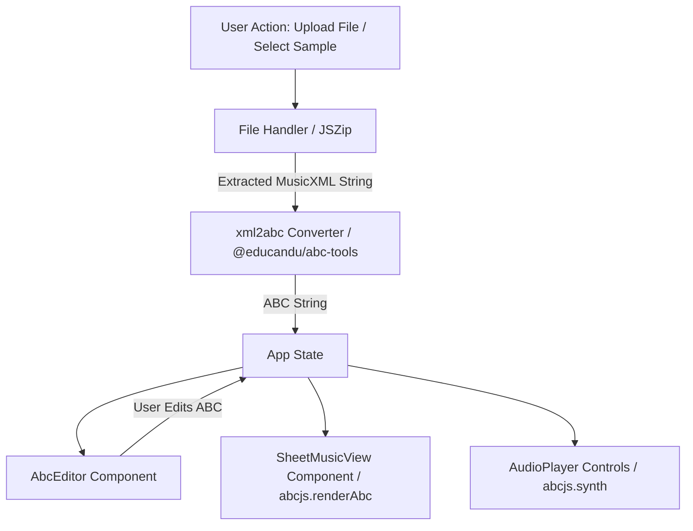

# Design & Architecture Specification: MusicXML to ABC Music Player (PoC)

## 1. Overview
This Proof of Concept (PoC) web application demonstrates importing MusicXML files (`.xml`, `.musicxml`, and compressed `.mxl`), converting them into ABC notation, rendering SVG sheet music, playing synthesized piano audio through WebAudio, and allowing users to view and edit the generated ABC code.

## 2. Tech Stack
- **Framework**: React 18 + Vite + TypeScript
- **Sheet Music Renderer & WebAudio Synth**: `abcjs` (v6.x)
- **MusicXML to ABC Converter**: `@educandu/abc-tools` (Wim Vree's `xml2abc` engine)
- **Compressed MusicXML (.mxl) Handler**: `jszip`
- **UI & Icons**: Vanilla CSS with modern Glassmorphism theme + `lucide-react`
- **Testing**: `vitest` + `@testing-library/react` + `jsdom`

## 3. Architecture & Data Flow

### Components Breakdown:
1. **`FileSelector.tsx`**: Drag-and-drop file upload zone + preset sample dropdown selector (including Beethoven's Für Elise `.mxl`).
2. **`SheetMusicView.tsx`**: Dynamically renders vector SVG music notation using `abcjs.renderAbc`. Supports scaling, transpose, and voice selection.
3. **`AudioPlayer.tsx`**: Integrated audio control bar (Play, Pause, Progress, Tempo/BPM adjustment, Master Volume) powered by `abcjs.synth.SynthController` & `CreateSynth`. Highlights active notes on the score during playback.
4. **`AbcEditor.tsx`**: View/edit ABC notation code side-by-side or collapsible with copy functionality and live re-rendering.

## 4. Key Workflows
- **Loading compressed `.mxl`**: Unzips container XML to find the main MusicXML file root, extracts raw string data, and feeds to `convertMusicXmlToAbc`.
- **Audio Synthesis**: Initializes WebAudio `AudioContext`, loads soundfont instruments, and syncs cursor callback with sheet music rendering.

## 5. Testing Strategy
- Unit tests for `.mxl` extraction and MusicXML to ABC conversion.
- Unit tests for React components (FileSelector, AbcEditor, SheetMusicView, AudioPlayer).
- End-to-end build validation using Vitest and Vite production build.
