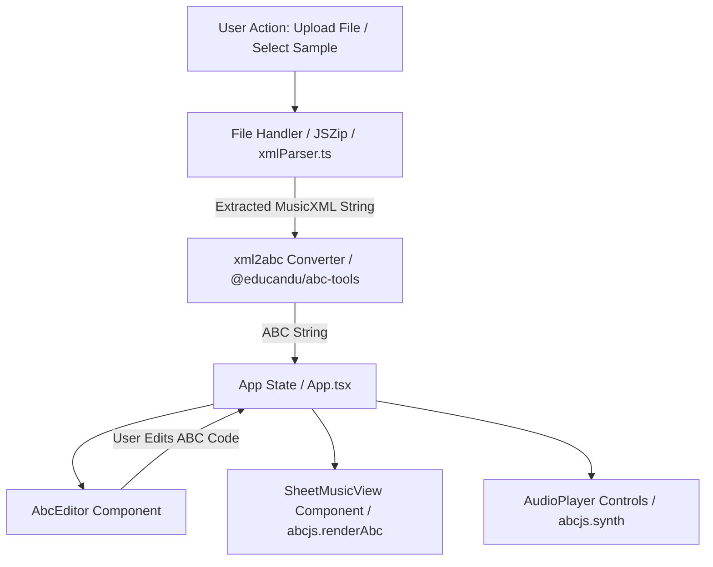

# Design & Architecture Specification: MusicXML to ABC Music Player (PoC)

## 1. Overview
This Proof of Concept (PoC) web application demonstrates importing MusicXML files (`.xml`, `.musicxml`, and compressed `.mxl`), converting them into ABC notation, rendering SVG sheet music, playing synthesized piano audio through WebAudio, and allowing users to view and edit the generated ABC code in real-time.

## 2. Tech Stack & Architectural Assessment
- **Framework**: React 18 + Vite + TypeScript
- **Sheet Music Renderer & WebAudio Synth**: `abcjs` (v6.x)
- **MusicXML to ABC Converter**: `@educandu/abc-tools` (Wim Vree's `xml2abc` engine)
- **Compressed MusicXML (.mxl) Handler**: `jszip`
- **UI & Icons**: Vanilla CSS with modern Glassmorphism theme + `lucide-react`
- **Testing**: `vitest` + `@testing-library/react` + `jsdom`

### Architecture Soundness Analysis:
1. **Unidirectional Data Flow**: State (`abcCode`, `activeFileName`, `tunes`) flows top-down from `App.tsx` into decoupled, single-responsibility presentational components (`FileSelector`, `SheetMusicView`, `AudioPlayer`, `AbcEditor`).
2. **Imperative Library Isolation**: `abcjs` (DOM/WebAudio imperative API) is cleanly wrapped inside custom React hooks/effects in `SheetMusicView.tsx` and `AudioPlayer.tsx`. Unmounting or code changes trigger proper cleanup of WebAudio synth instances and SVG DOM elements.
3. **High-Legibility Score Styling**: SVG score rendering uses `foregroundColor: '#000000'` with explicit CSS overrides for crisp black notes and staff lines on a white viewport, paired with a vibrant crimson-rose (`#e11d48`) active note highlight during playback.

## 3. Data Flow Diagram

### Components Breakdown:
1. **`FileSelector.tsx`**: Drag-and-drop file upload zone + preset sample dropdown selector (including Beethoven's Für Elise `.mxl` archive and standard XML samples).
2. **`SheetMusicView.tsx`**: Dynamically renders vector SVG music notation using `abcjs.renderAbc`. Supports zoom scaling (60% to 180%), semitone transposition (+1/-1/reset), and score event callbacks.
3. **`AudioPlayer.tsx`**: Integrated WebAudio piano synthesizer control bar (Play, Pause, Stop, Tempo/BPM slider, Master Volume, Mute toggle). Syncs active note highlights on the SVG score during playback.
4. **`AbcEditor.tsx`**: View/edit ABC notation code side-by-side or collapsible with copy functionality and live re-rendering.

## 4. Key Workflows
- **Loading Compressed `.mxl`**: Unzips `META-INF/container.xml` using `JSZip` to extract the main MusicXML file string, then converts to ABC notation.
- **Audio Synthesis & Cursor Sync**: Initializes WebAudio `AudioContext`, loads soundfont instruments, and syncs cursor callback (`.abcjs-highlight`) with SVG sheet music rendering.

## 5. Testing & Verification Suite
- **7 Test Files / 18 Unit Tests** running via Vitest:
  - `src/utils/__tests__/xmlParser.test.ts` (XML/MXL parsing & conversion)
  - `src/components/__tests__/Header.test.tsx` (App header & branding)
  - `src/components/__tests__/FileSelector.test.tsx` (Upload & preset selection)
  - `src/components/__tests__/SheetMusicView.test.tsx` (SVG rendering, zoom, transpose)
  - `src/components/__tests__/AudioPlayer.test.tsx` (Audio controls, tempo, volume)
  - `src/components/__tests__/AbcEditor.test.tsx` (ABC editor interaction & live updates)
  - `src/App.test.tsx` (End-to-end integration state sync)
- **Production Build Validation**: Clean compilation via `npm run build` (`tsc -b && vite build`).
